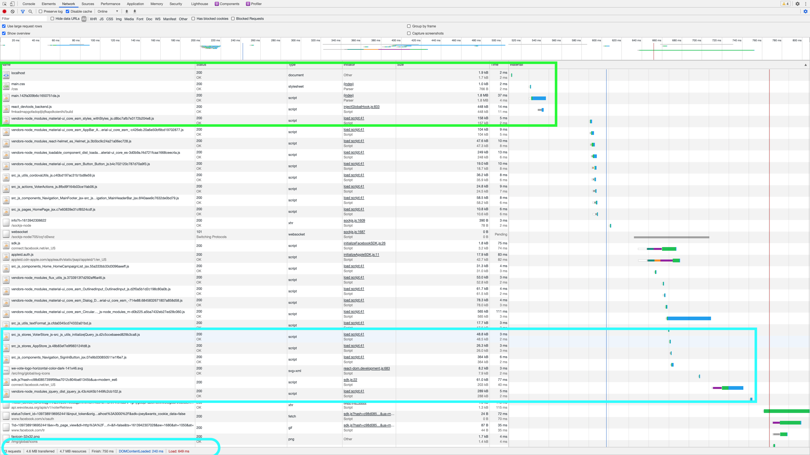
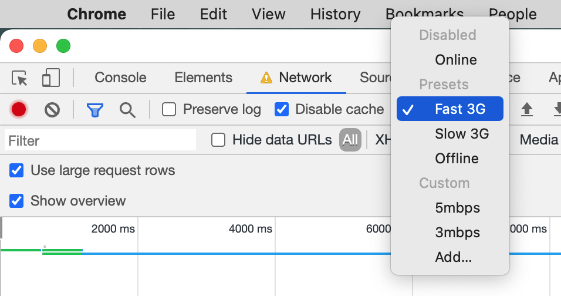

# We Vote Campaigns

This We Vote Campaigns repository contains a Node/React/Flux Javascript application. We have extensive instructions for [setting up your We Vote environment here](https://github.com/wevote/WebApp): 

Interested in [volunteering or applying for an internship](https://www.idealist.org/en/nonprofit/f917ce3db61a46cb8ad2b0d4e335f0af-we-vote-oakland#opportunities)? [Starting presentation here](https://prezi.com/5v4drd74pt6n/we-vote-introduction-strategic-landscape/). 
Please also [read about our values](https://docs.google.com/document/d/12qBXevI3mVKUsGmXL8mrDMPnWJ1SYw9zX9LGW5cozgg/edit) and 
[see our Code of Conduct](CODE_OF_CONDUCT.md)
To join us, please [review our openings here](https://www.idealist.org/en/nonprofit/f917ce3db61a46cb8ad2b0d4e335f0af-we-vote-oakland#opportunities), and express your interest by emailing JoinUs@WeVote.US


## Guidelines

- **Keep the "index.html" page very simple**. Don't load any scripts or css that are not required on the first page.
- **Keep the "Home" page very simple**, so that it gets to LCP (Largest Contentful Paint in (ideally) less than one second). 
- **Keep Stores and Actions pure**.  No calls to other actions or stores from within an action or store.
- **Lazy load all Libraries** except those that are absolutely needed on on the "Home" page.  If a page is Lazy loaded, any imports from that page are that page will be in the page's bundle. 
- **Don't Copy Code Blindly**.  Any code brought over from the WebApp should be trimmed down to the least amount of code necessary to 
do what you wanted to, and no more. 
  - New code should be atomic. It should do what it is supposed to, and not fire off queries that aren't necessary and related to the needs of the current code.
  - If you don't know what it does don't copy it.  Commenting out is ok in the beginning.
  - Getters and setters that are not yet used in Stores/Actions are OK.
  - Utility functions that are not yet used are OK.
- **Pull requests should have zero lint errors or warnings.**  If you "just gotta" check in code that would
  cause warnings, it is better to comment out the code that you (presumably) will need in the very near future than to 
    suppress the lint warnings with `// eslint-disable` meta comments.
  - If your IDE does not have built in lint checking, run `npm run lint` before submitting your PR, and clear all errors and warnings.
- **Check bundle sizes often**.  The base bundle` main.<some hash>.js` should not "exceed the recommended size limit (244 KiB).", we are currently
  at 232 KiB (February 2021).
  - While testing with the Webpack Bundle Analyzer, know that
    - sockjs.js and webpack-dev components are part of dev Webpack and "should not" end up in a production build.
  - Webpack minifies what it can when the cli option  "--mode production" is used, so compile with `npm run start-minified` to minify.
  - See the following section on how to use the 'Webpack Bundle Analyzer'
- **Follow styles defined on "/styles" page**.
- **We are purposefully NOT bringing over:**
  - Bootstrap/react-bootstrap.  Use Material-UI instead.
  - sass, and most css files.  Use styled-components instead.
  - The globally loaded Zendesk app, we will build a web link alternative

## Webpack Bundle Analyzer
Run ` npm run start-minified-analysis` to turn on the analyzer.  This gives a relative size analysis of the `main...js` bundle and
show what has been included.  Note that libraries like sock.js and react-dom.development.js are requrired
to run webpack and the analyzer, so the measured size in the screen shot that follows is 1.55 MB, which is far too big for
production to give the sub-half-second initial load that is our design goal.  But that 1.55 MB is bloated with webpack and analyzer
instrumention - you need to `npm run build` to see the real bundle size.


By running `npm run build` you make the actual production minified js files in the `/build` directory, and you can see that the 
actual size of the `main.<hash>.js` chunk (the only chunk loaded for the first page render) is 232,073 bytes -- success!  we meet the
244 KiB maximum size design goal.  
The rest of the app should be lazy loaded (chunks loaded only when needed) if we keep paying attention to load sizes, 
and avoiding adding libraries to that main.js file.  The initial load for the '/' URL is pretty much the App.js file,
with subsequent lazy loads depending on what internal URL we navigate to.
```
stevepodell@Steves-MacBook-Pro-32GB-Oct-2109 build % pwd 
/Users/stevepodell/WebstormProjects/Campaigns/build
stevepodell@Steves-MacBook-Pro-32GB-Oct-2109 build % ls -la main.*
-rw-r--r--  1 stevepodell  staff  232073 Feb 21 13:00 main.fece73861d088f951dab.js
-rw-r--r--  1 stevepodell  staff    1281 Feb 21 13:00 main.fece73861d088f951dab.js.LICENSE.txt
-rw-r--r--  1 stevepodell  staff  722047 Feb 21 13:00 main.fece73861d088f951dab.js.map
stevepodell@Steves-MacBook-Pro-32GB-Oct-2109 build % 
```
The following screen shot shows the Network tab of the Chrome devtools, after a hard reload (Cmd+Shift+R on a Mac).



In the first green box, you can see the initial load of the index.html ("localhost"), followed by the 
main.css (we are moving away from css, but still require some.)  

The Blue vertical line "DomContentLoaded" occurs at 
240 ms (see the oval at the bottom left of the shot), means that the screen has rendered and is visible to the
user.  Then in the blue box, you can see initializejQuery() method being called from the VoterStore.js.  jQuery is used
to make http request to the API server, so it is needed before we can do very much.  Then at the bottom of the
blue box you can see the (very large) jQuery minified libary being loaded.  Soon after we get to the red 
"Load" (Onload Event) vertical line, which means the page is running -- responsive to resizing and to user keystrokes.

We would like the red vertical line to be at less than 500ms, but 649ms is acceptable.  These numbers go up
quickly on slow internet connections, especially on mobile devices on a legacy "LTE" connection, or just on an overloaded 
higher speed urban cell.

## Performance testing

To test performance on your local computer, first run `npm run build` to create the production chunks in the /build directory.
Then run `node server-prod-local` to start a local express server that serves minified source, and compresses it before sending. 
(Like our production webservers.)

```angular2html
stevepodell@Steves-MacBook-Pro-32GB-Oct-2109 Campaigns % npm run build
...
webpack 5.19.0 compiled with 1 warning in 32886 ms
stevepodell@Steves-MacBook-Pro-32GB-Oct-2109 Campaigns % node server-prod-local
INFO: run 'npm run prod' FIRST to build the production bundle
INFO: this express server instance will not redirect from http to https, or vice versa.
INFO: Configured by the settings in settings in /src/js/config.js
INFO: express script started 2021-02-22T03:46:10.777Z
INFO: https server started 2021-02-22T03:46:10.790Z
INFO: Server is at https://localhost:3000
```


On the Chrome Dev Tools, Network Tab, make sure "disable cache" is checked and click "online" to simulate
slower networks.

There is a throttling setting, that defaults to "Online" that lets you experiment with slower networks.

| Date | Throttling | Onload Event (Lighthouse) | Red line (Network) | Throttling Type |
| --- | --- | --- | ---| ---|
| Feb 21, 2021 | Online | 344-388 milliseconds | 340-670 milliseconds | stock -- initial setting  |
| Feb 21, 2021 | 3 MBS | | 1.18 seconds | custom |
| Feb 21, 2021 | Fast 3G | | 5.5 seconds | stock |
| Feb 21, 2021 | Slow 3G | | 19.17 seconds | stock |




## Installation

- `git clone git@github.com:wevote/Campaigns.git`
- `cd Campaigns`
- `cp ./src/js/config-template.js ./src/js/config.js`
- `npm install`
- `npm start`
- `http://localhost:3000/` will open in a tab in your default browser.


## Useful Commands for Daily Development

- `npm install`
- `npm start`
- `npm run start-https`
- `npm run start-minified`
- `npm run start-minified-analysis`   Run minified and with the bundle analyser in http mode
- `npm run build`                     To populate the '/build' directory


